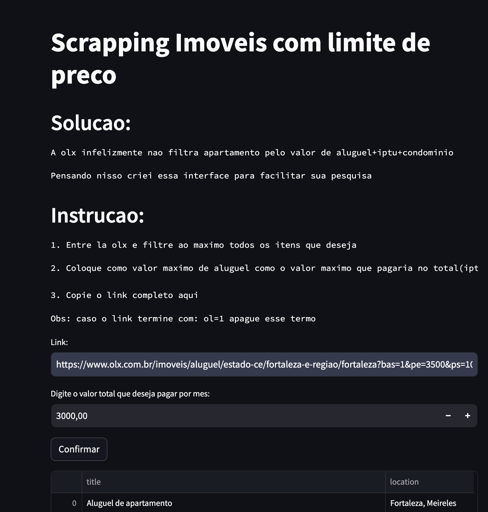
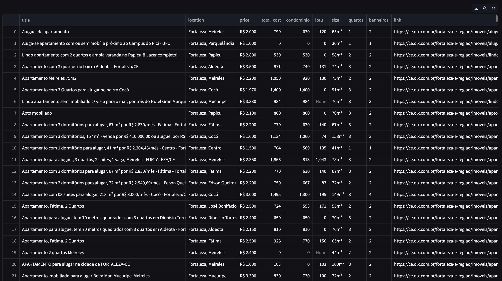

# Alugueis_olx
 
Automacao de cunho educativo e de uso pessoal.
A olx infelizmente nao filtra apartamento pelo valor de aluguel+iptu+condominio
entao criei um script para fazer isso.

## Baixando

### Instalacao

- Ambiente virtual python

    ```bash
    python -m venv venv
    ```

- Ativando ambiente virtual - MacOS/Linux

    ```bash
    source venv/bin/activate
    ```

- Ativando ambiente virtual - Windows

    ```bash
    venv\Scripts\activate
    ```

- baixar dependencias

    ```bash
    pip install -r requirements.txt
    ```

comando de execucao:

```bash
streamlit run scrapping_v2.py
```

## Exemplo:




by: [Marcus Castro](https://www.linkedin.com/in/marcus-castroo/)