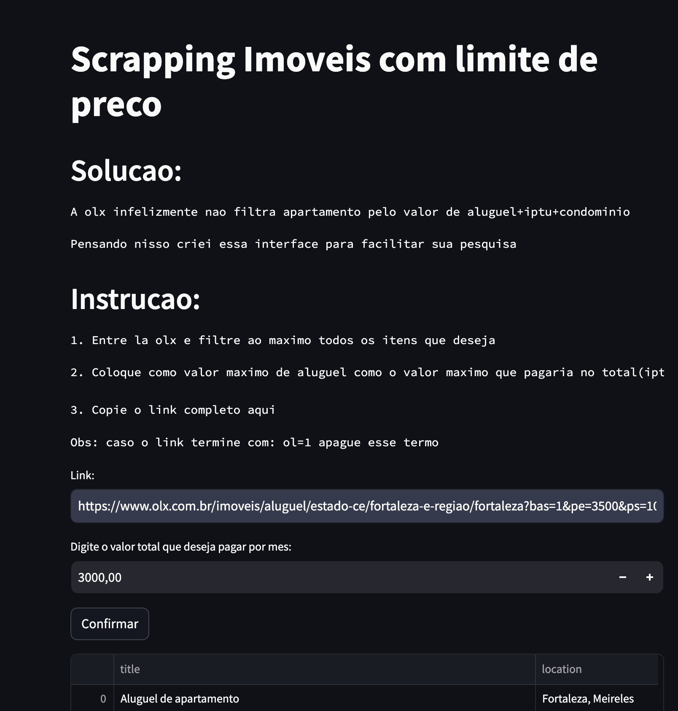
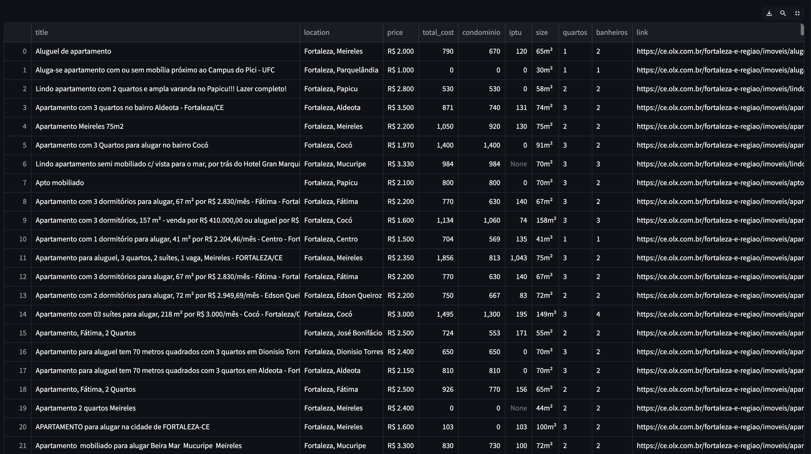

# Alugueis_olx

Automacao de cunho educativo e de uso pessoal.
A OLX infelizmente nao filtra apartamentos pelo valor total de aluguel + condominio,
entao criei essa ferramenta com interface interativa para facilitar a busca.

## Funcionalidades

- Scraping automatico dos anuncios da OLX via Selenium
- Calculo do custo total (aluguel + condominio)
- Filtro por valor maximo mensal
- Filtros interativos: custo total, aluguel, condominio, area, quartos, banheiros, vagas de garagem e localizacao
- Ordenacao por custo total, aluguel, condominio, area ou data do anuncio
- Visualizacao em **tabela** ou **galeria** com imagens dos anuncios
- Metricas resumidas: total encontrados, menor custo, custo medio, maior area e media de vagas

## Instalacao

1. Criar ambiente virtual Python

    ```bash
    python -m venv venv
    ```

2. Ativar ambiente virtual

    - MacOS/Linux:
        ```bash
        source venv/bin/activate
        ```
    - Windows:
        ```bash
        venv\Scripts\activate
        ```

3. Instalar dependencias

    ```bash
    pip install -r requirements.txt
    ```

## Execucao

```bash
streamlit run scrapping_v2.py
```

## Como usar

1. Entre na OLX e filtre ao maximo os itens que deseja
2. Coloque o valor maximo de aluguel como o valor total que pagaria (aluguel + condominio)
3. Copie o link completo e cole na sidebar da aplicacao
4. Clique em **Buscar**

> **Obs:** caso o link termine com `ol=1`, apague esse termo antes de colar.

## Exemplo




by: [Marcus Castro](https://www.linkedin.com/in/marcus-castroo/)
